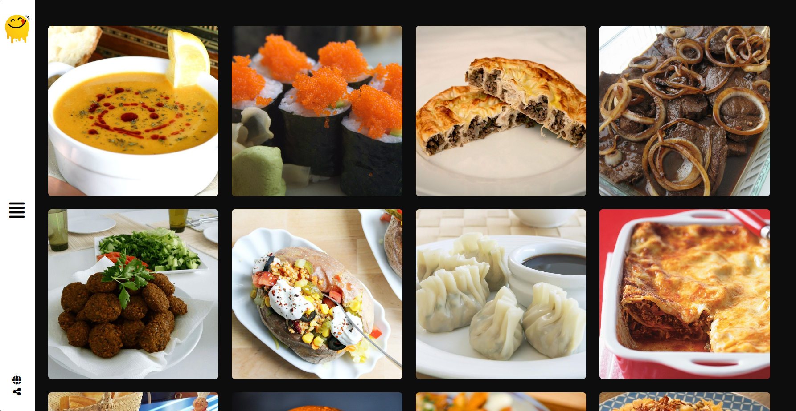

# Restaurant Website

Welcome to our restaurant's website repository! This website is built using native JavaScript to showcase our menu and meals, allowing users to easily explore our culinary offerings. Users can search for specific dishes by name or filter by the first letter. The website also provides a convenient way for users to contact us for inquiries, reservations, or any assistance they may need.

 

 

## Features
* Menu Display: The website prominently displays our menu, featuring a wide range of delicious meals categorized by type (appetizers, mains, desserts, etc.).
* Search Functionality: Users can search for specific dishes by name using the search bar. Additionally, they can filter the menu by the first letter of the dish's name for quicker navigation.
* Contact Us: A dedicated contact page is available for users to reach out to us. They can submit inquiries, make reservations, or request assistance using the contact form provided.

 

## Technologies Used
* HTML/CSS: The structure and styling of the website are implemented using HTML and CSS for a visually appealing user experience.
* JavaScript: Native JavaScript is used to implement the dynamic functionality of the website, including the search feature and contact form submission.
* Backend Integration: The contact form submission functionality is integrated with a backend server to process user inquiries and reservation requests.

 

## Installation and Usage
1- Clone the repository to your local machine.
 
2- Open the "index.html" file in your web browser to view the website.
 
3- Explore the menu, search for dishes, and use the contact form to reach out to us.

 

## Feedback and Support
If you have any feedback, suggestions, or encounter any issues while using the website, please don't hesitate to contact us via email at [badreldin6021@gmail.com]. We appreciate your support and strive to provide the best dining experience for our customers.

